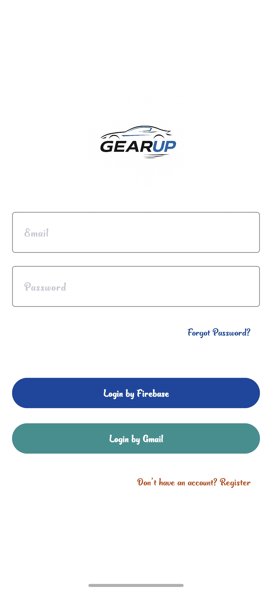
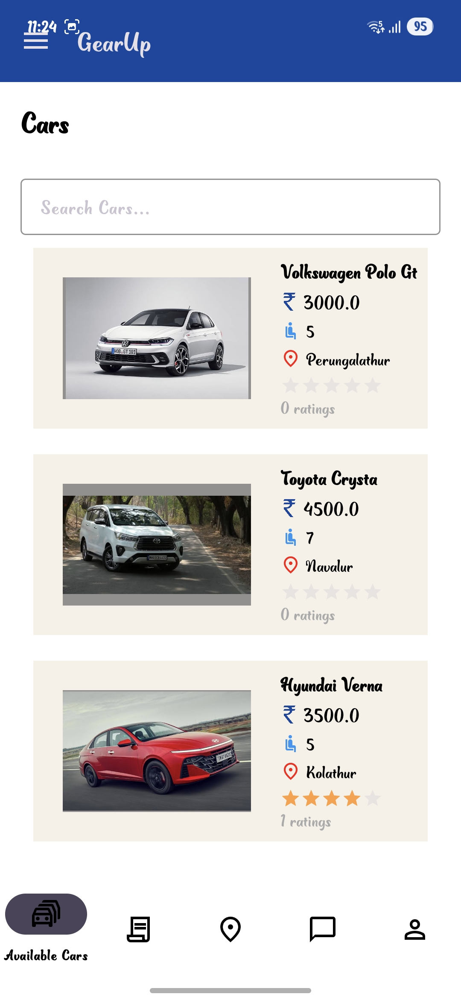
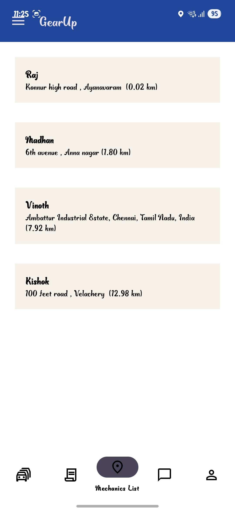
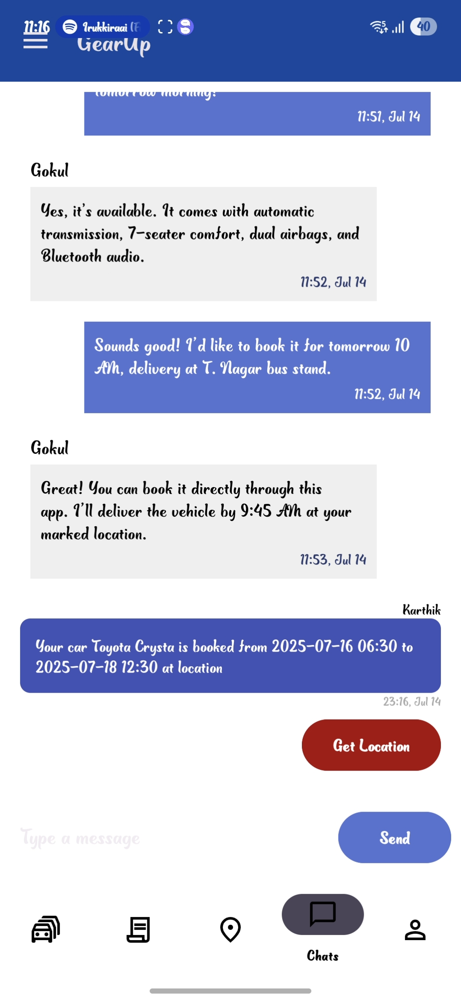

# GearUp: Car Rental & Instant Mechanic Support App 🚗🔧

**GearUp** is an Android-based mobile application designed to revolutionize the self-drive car rental experience while offering real-time mechanic support. This app bridges the gap between car owners (managers), customers, and mechanics—ensuring safe rentals and quick breakdown assistance.

---

## 📖 About

This project was originally inspired by an open-source template but has been significantly customized and enhanced. Key modules, authentication mechanisms, UI layouts, and business logic have been restructured to align with real-world use cases relevant to the Indian market, especially for **yellow board vehicle rentals**.

---

## 🧑‍💼 User Roles

### 👤 **Customer**
- Login via OTP authentication.
- Search and view available rental cars by brand, fuel type, and price.
- Book cars for specific dates with delivery location.
- Access a list of nearby mechanics in case of breakdown.
- Real-time chat with car managers or mechanics.

### 🚗 **Manager (Car Owner)**
- Register with mobile number and upload shop license (PDF) for admin verification.
- Add and manage car listings (images, price, documents).
- View rental bookings from customers and manage car availability.

### 🛠️ **Mechanic**
- Register as a verified mechanic with service area.
- Displayed to nearby customers during vehicle breakdowns.
- Available for direct chat or call by customers.

### 🛡️ **Admin**
- Review and approve manager registrations based on license verification.
- Monitor and block users or managers as needed.
- Manage app-wide data consistency and control.

---

## 📝 Key Features

- ✅ OTP-based Firebase Authentication for secure login.
- 🚙 Yellow board car listings with verified documents.
- 📍 Location-based discovery of nearby mechanics.
- 💬 Real-time Firebase chat module between customer, manager, and mechanic.
- 📄 Admin-controlled manager approval workflow.
- 📸 Firebase Storage for uploading car images and PDF licenses.
- 🔐 Role-based access and separate dashboards for each user type.

---

## 💻 Technologies Used

- **Frontend**: Java, XML (Android)
- **Backend**: Firebase Firestore, Firebase Auth, Firebase Storage
- **Tools**: Android Studio, Firebase Console, GitHub

---

## 📸 Screenshots

### 🔑 Login 

### 🧍 Customer Dashboard & Booking

### 📍 Nearby Mechanics

### 🧾 Car Listing

### 🗂️ Admin Approval Panel

### 💬 Chat Support

---

## 📂 Folder Structure

